# Orchid Shop data automation application

This is a terminal application to track shop sales, calculate expenses and profit, figure out recommended amount to have in stock. 

All data provided through the terminal input goes into a google spreadsheet.

In the end, the user gets the total day profit of the day and recommendations for stock printed to the terminal for user's convenience so that they do not have to open the spreadsheet.

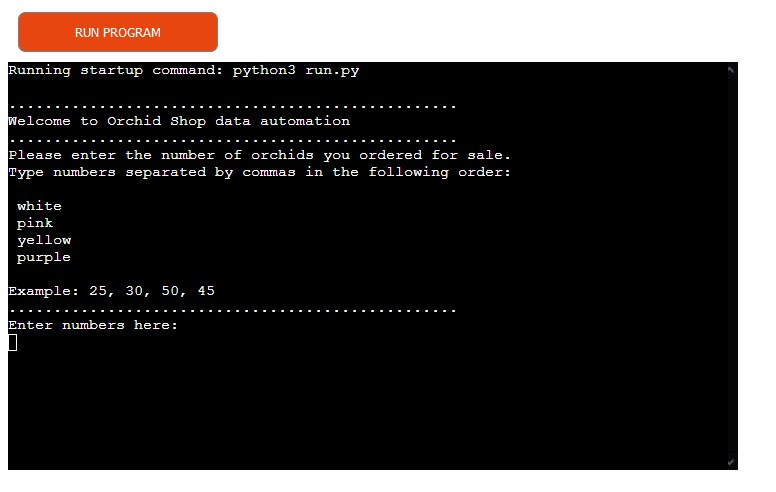

This is the link to the live app:

https://orchid-shop-app.herokuapp.com/

## Application goals:

* Provide a simple application to allow the user calculate their sales and profit easily.
* Give the user stock recomendation based on previous week sales.

## Target audience

Small shops owners who want to keep track of stock, their profit and increase it.

## User story

* As a user, I would like to be able to easily enter my data and see the request again if I entered invalid data.

* As a user, I would like to be able to get my sales and expenses calculated for me.

* As a user, I would like to see the surplus.

* As a user, I would like to be able to see my total day profit calculated for me and the profit for each item to see which ones I should sell more.

* As a user, I would like to be able to get recommendations for my stock to increase my sales.

* As a user, I would like to keep all my data structured in a document.

## How to use the app

The app is based on the data the user provides in inputs.
There are 2 inputs:

1. Numbers of items bought to the stock of each type. In total 4 numbers must be provided.
2. Numbers of items sold of each type. In total 4 numbers.

According to the data provided the application calculates:

* the recommended ammount of items to have in stock with additional 5% to increase sales (according to last week sales);

* the expenses and income according to the trade (7 euros) and retail (9 euros) prices;

* the profit gained from every item and in total for the day.

The results are inserted into google spreadsheet and saved in relevant worksheets.

## Application logic flow

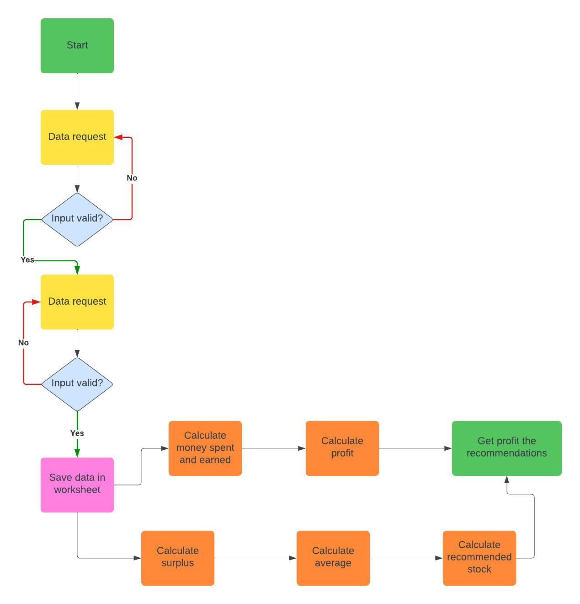

## Features:

Simple, easy to use application with clear navigation.

### Accepts user input.

 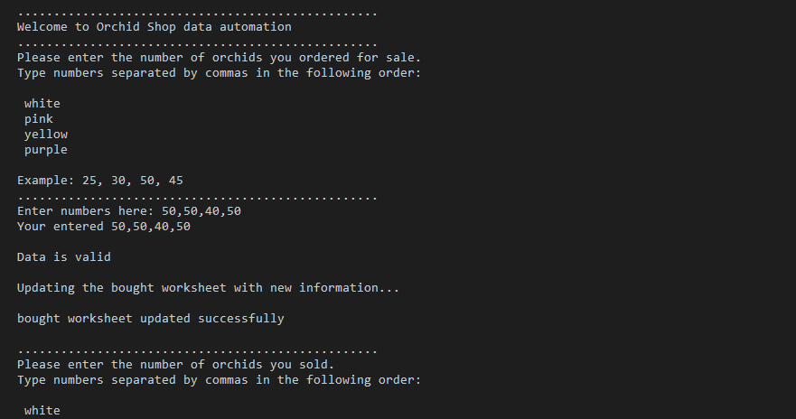

### Validates input.
    1. Checks if there are exactly 4 numbers separated by commas.
    2. Checks if the data provided is a number.
    3. If there's a mistake an error is raised. And the input request repeats.

 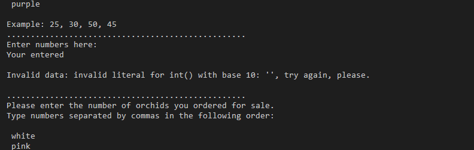

### Calculates money spent and earned for each item.

 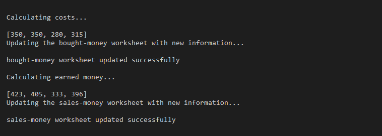

### Calculates profit for each item and total for the day.

 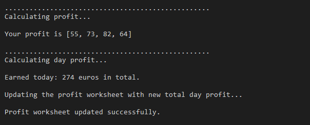

### Calculates recommended stock and gives recommendations of quantity to buy next time.

 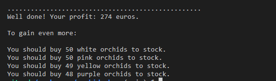
 
 ### Data is uploaded to the google spreadsheet.

 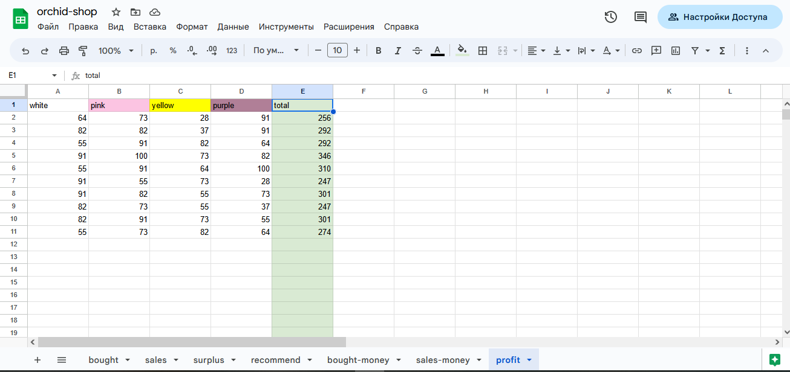

## Testing

I have tested this application manually.

* Used PEP8 linter and confirms that there no errors.

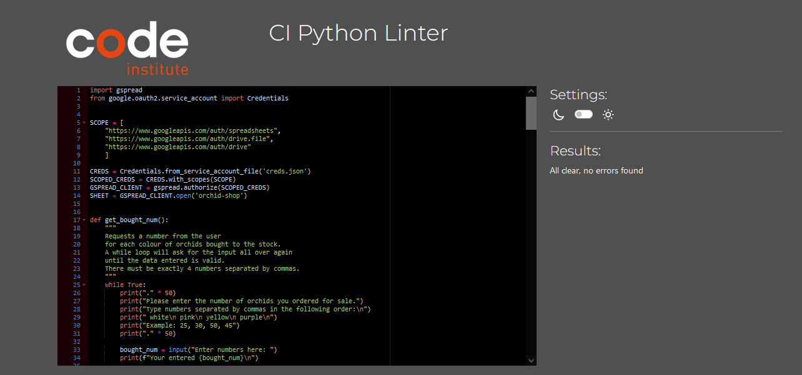

* Tested in my gitpod terminal and Heroku terminal.

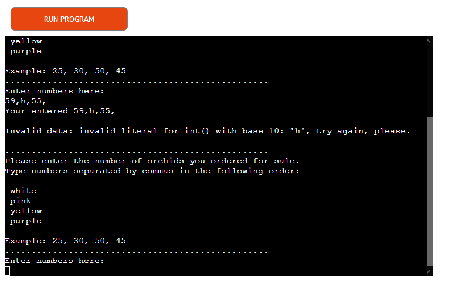

* Tested invalid inputs:

    * Empty input - Invalid data error is raised and data is requested again.
    

    * Too many or not enough numbers - Invalid data error is raised, it shows how many the user entered and reminds to enter 4 numbers, then data is requested again.
    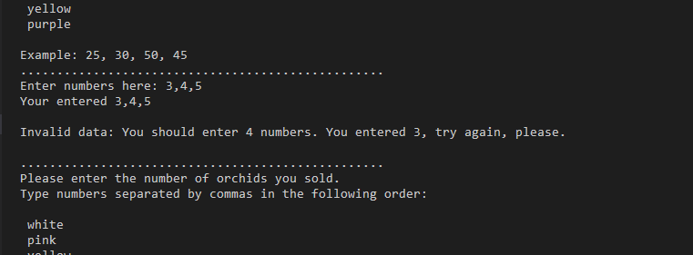

    * A letter instead of a number - Invalid data error is raised, it shows what the user entered and reminds to enter numbers, then data is requested again.
    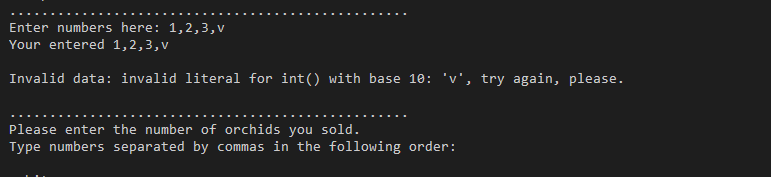

    *  A symbol instead of a number - Invalid data error is raised, it shows what the user entered and reminds to enter numbers, then data is requested again.
    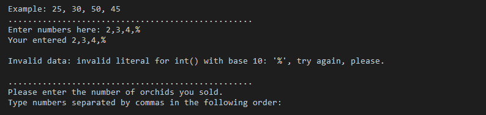

* Tested calculations manually with a calculator.

For example: the total profit of the 1st day is a sum of all items:

The function worked as expected and calculator confirmed this result.

64 + 73 + 28 + 91 = 256

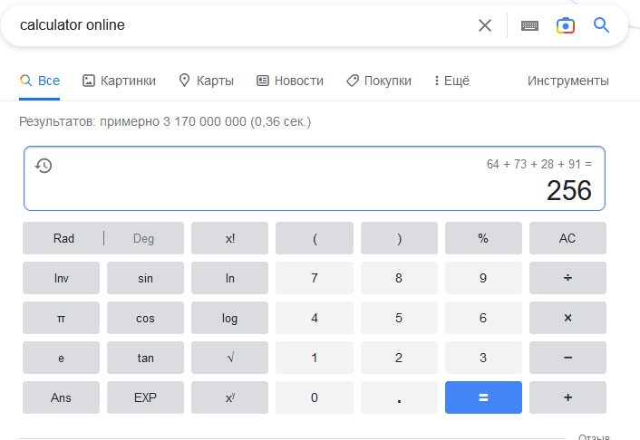

## Bugs

At first, there was profit calculated for each item separately and the worksheet updated with this data.

Then the total profit of the day was calculated and updated the worksheet.

So the bug was that there were 2 lines for this day: one with 4 values and the next with the same 4 values + 1 for total profit.

This bug was fixed by removing update function after calculating items profit.

Now the order is:
    calculate items profit
    calculate total day profit
    update worksheet

No bugs remaining.

## Deployment

This application is deployed to Heroku. The following steps were taken:

    1. Go to Heroku and to create a new app clicking "New".
    2. Choose a name and region for an app, click "Create app".
    3. Go to "Settings" and navigate to Config Vars. Add the following config variables:
        PORT : 8000
        CREDS : code from creds.json file
    4. Go to Buildpacks and add some for first Python and then NodeJS.
    5. Open "Deploy" tab. Select Github as the deployment method, authorize and search for repository by its name and connect.
    6. Choose Enable Automatic Deploys, main branch.
    7. Click Deploy a GitHub branch (main).
    8. The app was successfully deployed. Click View.

## Technologies:

* Python (the main language to build the app)

* gspread package (to connect python to Google Sheets)

* Google Sheets (to store all the data)

## Credits

Code Institute for student template 

Code Institute Love Sandwiches tutorial.

W3C was used as a reference for python functions.

